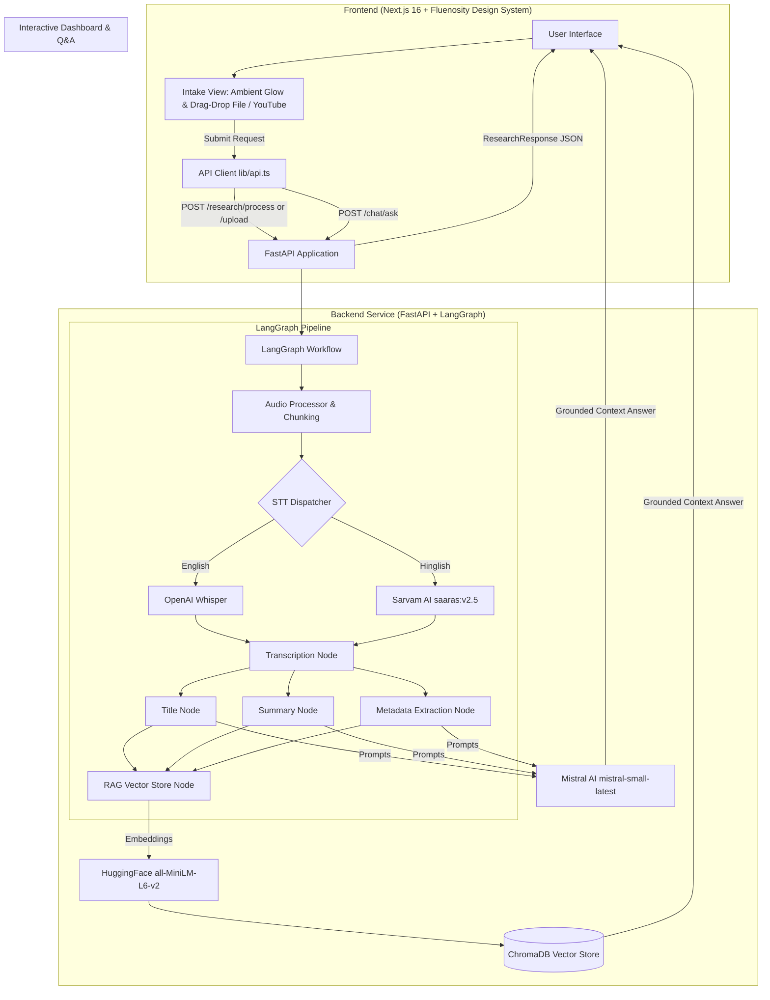

# 🎙️ Recap AI — Production-Grade AI Meeting Intelligence & RAG Platform

> **Transform meeting recordings and YouTube videos into structured action items, executive summaries, key decisions, and an interactive context-aware Q&A assistant.**

---

## 🌟 Key Features

* **🎥 Dual Ingestion Engine**: Process meeting recordings via direct file upload (`.mp3`, `.wav`, `.mp4`, `.m4a` up to 500MB) or extract audio directly from YouTube URLs.
* **🎨 Fluenosity Dark-First Design System**: Modern obsidian & electric violet design system with HSL design tokens, ambient radial glows, glassmorphism cards, Class Variance Authority (`cva`), and `@phosphor-icons/react`.
* **🌐 Hinglish & Indic Multi-Language STT**: Dual transcription routing — **OpenAI Whisper** for English and **Sarvam AI (`saaras:v2.5`)** for Indic code-switching and Hinglish speech-to-text.
* **⚡ State Graph Workflow Orchestration**: Built on **LangGraph** for reliable, stateful execution of audio chunking, transcription, summarization, extraction, and vector store indexing.
* **📊 Comprehensive Insight Extraction**: Generates concise meeting titles, bulleted summaries, and structured metadata:
  * **Action Items**: Task description, responsible owner, and deadline.
  * **Key Decisions**: Team decisions and consensus items.
  * **Open Questions**: Unresolved topics requiring follow-up.
* **💬 Grounded RAG Q&A Assistant**: Embedded **ChromaDB** vector database with HuggingFace sentence transformer embeddings (`all-MiniLM-L6-v2`) and **Mistral AI** (`mistral-small-latest`) for strictly grounded meeting Q&A.
* **✨ Modern Micro-Animations**: Next.js 16 + React 19 web interface featuring smooth Framer Motion tab transitions, 6-stage animated progress timeline, and session persistence.

---

## 🏗️ End-to-End System Architecture



---

## 📂 Repository Structure

The project is structured as a monorepo containing full-stack backend and frontend applications:

```text
recap-ai/
├── backend/                  # Python FastAPI & LangGraph backend service
│   ├── app/
│   │   ├── api/routes/       # API endpoints (research, upload, chat)
│   │   ├── config/           # Settings & environment variables
│   │   ├── core/             # LLM, Embedding models & LangChain prompts
│   │   ├── graph/            # LangGraph workflow, nodes & state definitions
│   │   ├── schemas/          # Pydantic request & response models
│   │   └── services/         # Audio processing, transcriber, RAG & extractor
│   ├── downloads/            # Temporary YouTube audio storage
│   ├── uploads/              # Temporary file upload storage
│   ├── vector_db/            # Persisted ChromaDB storage directory
│   ├── .env                  # Backend environment configuration
│   ├── README.md             # Backend detailed documentation
│   └── requirements.txt      # Python package dependencies
│
├── frontend/                 # Next.js 16 Fluenosity Web Application
│   ├── app/                  # Next.js App Router pages & Fluenosity global CSS
│   ├── components/           # UI components (Intake, Processing, Dashboard, Chat)
│   │   └── ui/               # Fluenosity UI Primitives (cva + Phosphor Icons)
│   ├── hooks/                # Custom React hooks (useMeetingSession, useChat)
│   ├── lib/                  # API client, types & constants
│   ├── .env.local            # Frontend environment configuration
│   ├── README.md             # Frontend detailed documentation
│   └── package.json          # Node.json package dependencies
│
└── Readme.md                 # Project root documentation
```

> 📖 For detailed module documentation, see [backend/README.md](file:///c:/Users/sreem/Desktop/recap-ai/backend/README.md) and [frontend/README.md](file:///c:/Users/sreem/Desktop/recap-ai/frontend/README.md).

---

## 🧰 Technology Stack

| Domain | Technology | Purpose |
| :--- | :--- | :--- |
| **Frontend Core** | **Next.js 16 (App Router)** | Web application framework |
| **Design System** | **Fluenosity Theme & Tokens** | Obsidian & Electric Violet HSL color system |
| **UI Primitives** | **React 19 & TypeScript & `cva`** | Class Variance Authority modular components |
| **Icons & Motion** | **`@phosphor-icons/react` & Framer Motion** | Unified phosphor iconography & micro-interactions |
| **Styling** | **Tailwind CSS v4** | Glassmorphism & ambient background glow overlays |
| **Backend Core** | **FastAPI & Uvicorn** | High-performance async REST API |
| **Orchestration** | **LangGraph & LangChain** | Stateful graph pipeline workflow orchestration |
| **LLM Provider** | **Mistral AI (`mistral-small-latest`)** | Summarization, metadata extraction & RAG QA |
| **Speech-to-Text** | **OpenAI Whisper & Sarvam AI (`saaras:v2.5`)** | Multi-lingual STT (English & Hinglish translation) |
| **Vector DB & RAG** | **ChromaDB & HuggingFace (`all-MiniLM-L6-v2`)** | Embedding generation & vector similarity search |

---

## ⚡ Quick Start Guide

### Prerequisites
* **Python 3.12+**
* **Node.js 18+ / 20+**
* **FFmpeg** (Installed and available in system PATH)

---

### 1. Setup Backend Service

```bash
# Navigate to backend folder
cd backend

# Create virtual environment
python -m venv .venv

# Activate virtual environment
# Windows (PowerShell):
.venv\Scripts\activate
# Linux/macOS:
source .venv/bin/activate

# Install dependencies
pip install -r requirements.txt
```

Create `.env` inside `backend/`:
```env
MISTRAL_API_KEY=your_mistral_api_key_here
SARVAM_API_KEY=your_sarvam_api_key_here
SARVAM_STT_MODEL=saaras:v2.5
WHISPER_MODEL=base
```

Start the backend server:
```bash
uvicorn app.main:app --reload --host 0.0.0.0 --port 8000
```
Swagger API Documentation will be live at `http://localhost:8000/docs`.

---

### 2. Setup Frontend Application

Open a new terminal:
```bash
# Navigate to frontend folder
cd frontend

# Install dependencies
npm install
```

Create `.env.local` inside `frontend/`:
```env
NEXT_PUBLIC_API_BASE_URL=http://localhost:8000
```

Start the frontend development server:
```bash
npm run dev
```

Open [http://localhost:3000](http://localhost:3000) in your browser to experience **Recap AI**!
